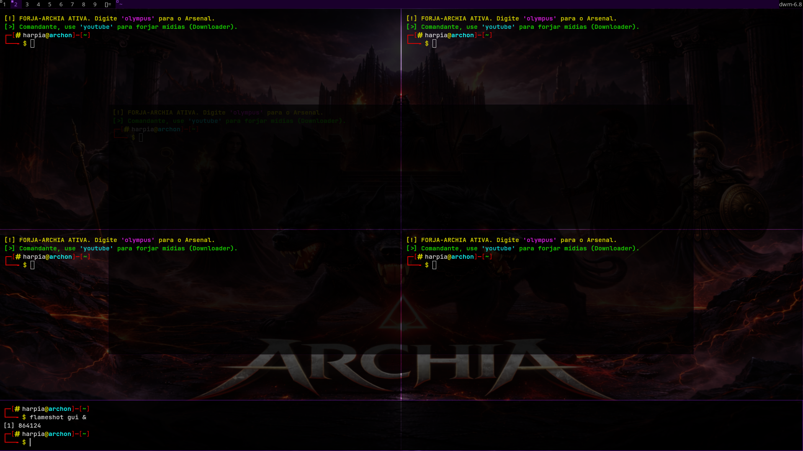

# Meu DWM Personalizado 🚀

Esta é a minha build customizada do **dwm** (Dynamic Window Manager), focada em um visual moderno, layouts inteligentes e máxima produtividade.

<p align="center">
  
</p>

> 💡 **Nota sobre a tecla modificadora:** A tecla principal (`MODKEY`) configurada nesta build é a tecla **Super** (também conhecida como tecla Windows).

---

## ⌨️ Atalhos Principais (Keybindings)
### 🚀 Programas e Terminais

| Atalho | Ação |
| :--- | :--- |
| `Super` + `Enter` | Abre o terminal padrão (**Kitty**) |
| `Super` + `F1` | Abre a Sanfona (Terminal de Rodapé) |
| `Ctrl` + `D` | Fecha a Sanfona (Encerra o terminal ativo) |

### 🖼️ Gerenciamento de Janelas (Ações Rápidas)

| Atalho | Ação |
| :--- | :--- |
| `Super` + `Q` / `Escape` | Fecha a janela focada imediatamente |
| `Super` + `J` / `K` | Navega o foco entre as janelas |
| `Super` + `Space` | Alterna janela entre modo Flutuante ou Lado a Lado |
| `Super` + `F` | Modo Monocle (Janela atual em Tela Cheia) |
| `Super` + `B` | Oculta ou exibe a barra roxa do topo |

### 📐 Controle de Layout e Multi-Monitor


| Atalho | Ação |
| :--- | :--- |
| `Super` + `H` / `L` | Encolhe ou expande a área principal (Master) |
| `Super` + `I` / `D` | Aumenta ou diminui número de janelas no Master |
| `Super` + `,` (Vírgula) | Move o foco para o monitor da Esquerda |
| `Super` + `.` (Ponto) | Move o foco para o monitor da Direita |
| `Super` + `Shift` + `,` | Envia a janela atual para o monitor da Esquerda |
| `Super` + `Shift` + `.` | Envia a janela atual para o monitor da Direita |

### ⛔ Sistema e Workspaces


| Atalho | Ação |
| :--- | :--- |
| `Super` + `[1 até 9]` | Alterna entre as áreas de trabalho |
| `Super` + `Shift` + `[1-9]` | Transfere a janela para aquela área |
| `Super` + `R` | Dá Reload no DWM (Aplica mudanças sem deslogar) |
| `Super` + `Shift` + `Q` | Encerra o DWM (Sair do Sistema) |

---

## 🛠️ Como Instalar e Compilar

### 1. Instalar as dependências (Debian/Ubuntu)
Antes de compilar, certifique-se de ter as ferramentas necessárias instaladas no seu sistema:
```bash
sudo apt install make gcc libx11-dev libxft-dev libxinerama-dev
```

### 2. Compilar e Instalar
Abra o terminal na pasta deste projeto e execute o comando abaixo para limpar builds antigas e instalar a nova:
```bash
sudo make clean install
```

